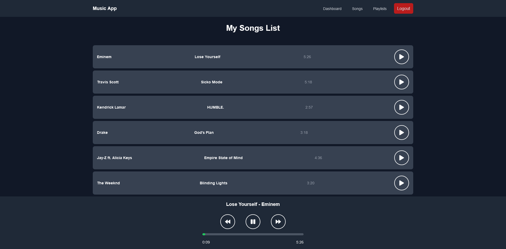

## Project Overview 
This Music App enables user authentication and provides a dashboard for navigating playlists and songs. Users can manage songs, create and delete playlists, and enjoy music playback through a simple interface featuring essential controls.

## Features
- User Authentication
- Playlists and Songs Management
- Real time sate management using React Context API
- APIs that allows communication with mock database (Login, Signup, Playlists)
- Progress bar to see songs duration 

## Requirements
`
Nodejs v20.17.0 
`

## Images  
### Songs

### Playlists


### Run the Project 
First, run the development server:

```bash
npm run dev
# or
yarn dev
# or
pnpm dev
# or
bun dev
```

Open [http://localhost:3000](http://localhost:3000) with your browser to see the result.

You can start editing the page by modifying `app/page.js`. The page auto-updates as you edit the file.

This project uses [`next/font`](https://nextjs.org/docs/basic-features/font-optimization) to automatically optimize and load Inter, a custom Google Font.

## Learn More

To learn more about Next.js, take a look at the following resources:

- [Next.js Documentation](https://nextjs.org/docs) - learn about Next.js features and API.
- [Learn Next.js](https://nextjs.org/learn) - an interactive Next.js tutorial.

You can check out [the Next.js GitHub repository](https://github.com/vercel/next.js/) - your feedback and contributions are welcome!

## Deploy on Vercel

The easiest way to deploy your Next.js app is to use the [Vercel Platform](https://vercel.com/new?utm_medium=default-template&filter=next.js&utm_source=create-next-app&utm_campaign=create-next-app-readme) from the creators of Next.js.

Check out our [Next.js deployment documentation](https://nextjs.org/docs/deployment) for more details.


## Cypress Tests 
* Run cypress (Launch server first with `npm run dev`)

        npx cypress open

* Select 'e2e' window after browser is launched, tests should run properly